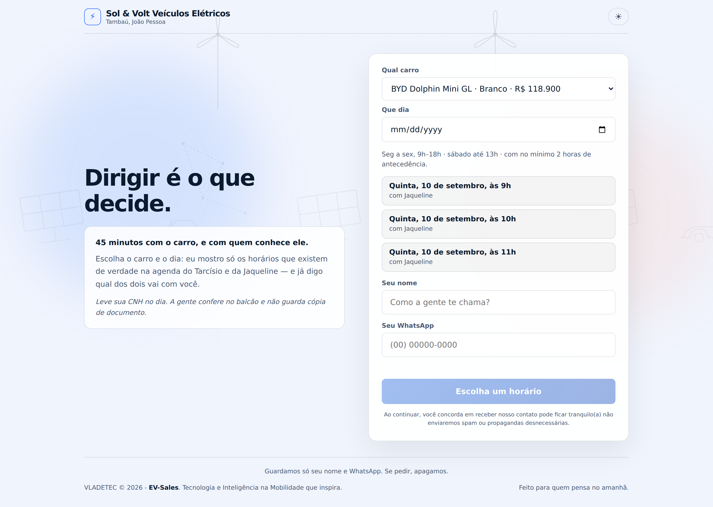
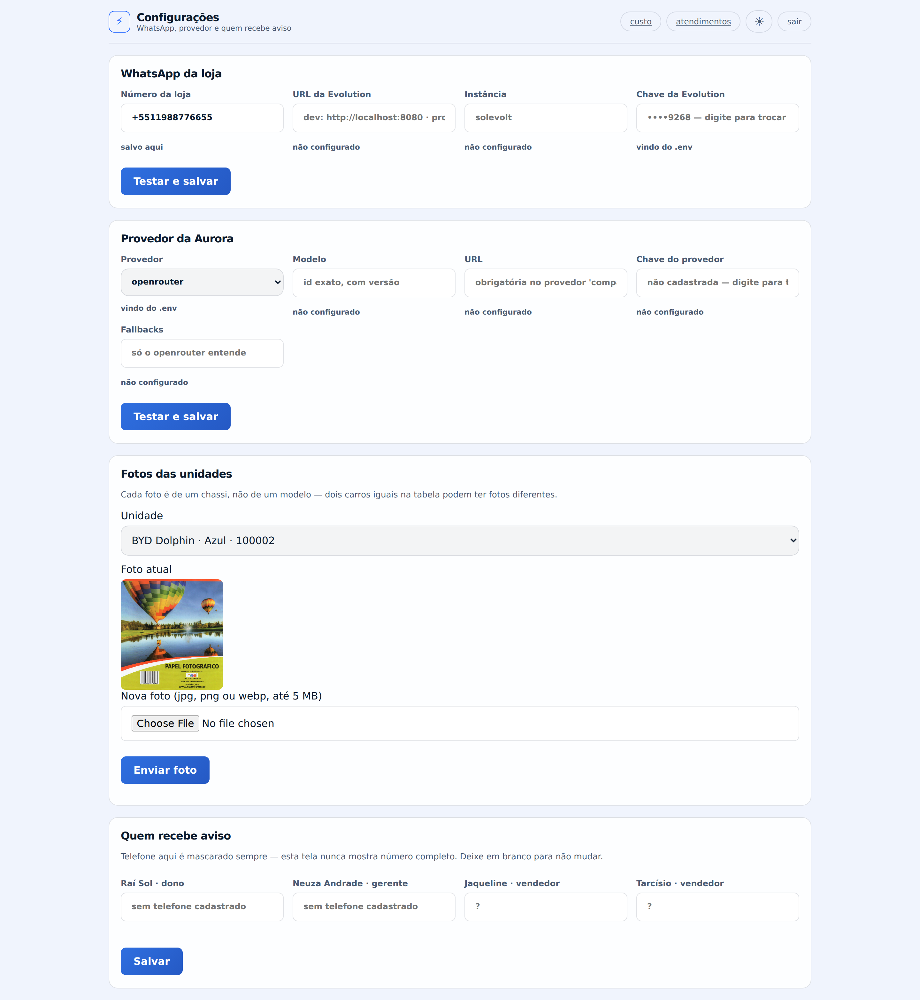

# EV-Sales

Agente de vendas por IA para concessionária de veículos elétricos, do primeiro contato até o
test drive marcado. A **Aurora** atende pelo site ou pelo WhatsApp, qualifica o cliente,
recomenda a partir do estoque real, pede aprovação da gerente quando a condição foge da tabela
e reserva o chassi — sempre a mesma conversa, nos dois canais.

Duas regras sustentam o resto: **todo número vem de uma consulta ao Postgres, nunca do modelo**,
e **nada irreversível acontece sem uma pessoa aprovar**. Um agente com tools filtradas por etapa,
sobre FastAPI, Postgres com pgvector e um front em HTML sem build.

A **Sol & Volt** é uma concessionária multimarca de carros elétricos em Tambaú, João Pessoa. O
**Raí** vendeu a loja de combustão que era do pai dele, em 2022, e apostou tudo em elétrico. Ele
recebe cerca de 280 conversas por mês, tem dois vendedores, e **41% dessas conversas morrem sem
resposta no mesmo dia**.

E a Aurora **não vende o carro**. Ninguém compra um elétrico de R$ 250 mil sem sentar dentro dele: nota
fiscal, faturamento contra a montadora e crédito aprovado por banco já acontecem na loja, por
obrigação legal. O fim da jornada digital é colocar um cliente qualificado dentro do carro certo,
com um vendedor que já sabe o que ele precisa.

## As telas


<details>
<summary><b>Ver as outras telas</b> — catálogo, login, test drive, custo e configurações</summary>

<br>

<table>
<tr>
<td width="50%"><br><sub><b>/catalogo</b> — estoque por chassi, com a fonte da autonomia ao lado do número</sub></td>
<td width="50%"><br><sub><b>/entrar</b> — sessão por cookie, três perfis</sub></td>
</tr>
<tr>
<td width="50%"><br><sub><b>/test-drive</b> — agenda real, com vendedor atribuído</sub></td>
<td width="50%"><br><sub><b>/custo</b> — teto do mês e o que já foi gasto</sub></td>
</tr>
<tr>
<td colspan="2"><br><sub><b>/configuracoes</b> — WhatsApp, provedor da LLM e fotos das unidades. Só o <code>dono</code> entra; a chave nunca volta em claro</sub></td>
</tr>
</table>

</details>

## O detalhe que define a arquitetura

Concessionária não vende SKU com quantidade. Vende **unidade com chassi**. Não existe "3 Seal em
estoque" — existe o Seal branco `…4471` e o Seal cinza `…9902`. E metade do estoque é seminovo
premium, onde não existe "outro igual" nem na teoria: aquele Taycan tem aquela quilometragem e
aquele preço.

O medo que o Raí repetiu mais vezes:

> "Carro eu tenho um de cada. Se esse negócio prometer o mesmo Seal branco pra duas pessoas,
> alguém vai ter que ligar pra uma delas e desmarcar. E esse alguém sou eu."

Isso torna a reserva irreversível de verdade, e faz a operação crítica do sistema ser uma corrida
entre dois clientes pelo mesmo carro — um pelo site, outro pelo WhatsApp, no mesmo segundo.

## Arquitetura

Um agente, tools filtradas por etapa da conversa, e uma pausa antes do irreversível:

```
 landing ──▶ chat (SSE) ──▶ AURORA ──⏸── NEUZA aprova ──▶ reserva ──▶ test drive
    │                          │                            │              │
    │                     tools por etapa            UPDATE … WHERE        │
    │                     (a lista muda,             status='disponivel'   │
    │                      não o prompt)             ← a corrida acaba aqui│
    │                                                                      │
    └──▶ wa.me ──▶ WhatsApp ──▶ mesma conversa, mesmo id, outro canal      │
                                                                           │
 ═════════════ fim do EV-Sales ════════════════════════════════════════════╪══════
                                                                           │
              a venda é PRESENCIAL, no sistema que a loja já tem     desfecho ◀┘
              (financiamento, faturamento, NF-e, documentação)       1 toque
```

Na etapa de qualificação, **não há tool de escrita registrada** — não é uma proibição no prompt, é
uma lista que não contém a função. Na etapa de espera pela Neuza, a lista está vazia. E a pausa não
é mecanismo: é uma linha no Postgres, então reiniciar o container no meio não tem efeito.

## Stack

| Camada | Escolha | Por quê |
|---|---|---|
| Orquestração | **Nenhuma** — loop de tools + estado em tabelas | O Raí precisa ler onde a conversa parou, com SQL. Checkpoint serializado guardaria o estado uma segunda vez, e estado duplicado diverge |
| Dados | Postgres + pgvector | Fonte da verdade de preço *e* estado do agente. ~2.800 chunks não pagam um banco vetorial dedicado |
| LLM | OpenRouter atrás de interface própria | Custo real por conversa vem do faturamento; trocar de modelo é uma variável de ambiente |
| WhatsApp | Evolution API, **só respondendo** | O cliente inicia por `wa.me`. Disparo ativo arrisca o número da vitrine |
| Observabilidade | Trilha no Postgres; Langfuse self-hosted planejado | Duas leituras da mesma origem: transcrição para o Raí, trace para mim. O exportador para o Langfuse é a borda que falta da [S-08](docs/spec/S-08-observabilidade-e-custo.md) |
| API / Front | FastAPI, com o front em HTML/CSS/JS **sem build** | Cinco telas estáticas não pagam um pipeline de build, e a equipe da Sol & Volt abre o arquivo e lê. Decisão ainda sem ADR — ver [ARQUITETURA](docs/ARQUITETURA.md#onde-o-código-está-hoje) |

Quatro containers no `docker-compose.yml`: `postgres`, `minio`, `evolution` e `api`. **Sem Qdrant, sem Prometheus/Grafana/Loki** — cada ausência tem ADR. O `nginx`, o `redis`, o `worker` e o Langfuse estão na [S-10 §1](docs/spec/S-10-operacao.md) e ainda não subiram: a rotina que seria do `worker` é hoje uma tarefa no processo da API, escrito no [RUNBOOK](docs/RUNBOOK.md) para ninguém procurar container que não existe.

## Subir o projeto

**Pré-requisitos:** Docker + Docker Compose, e [uv](https://docs.astral.sh/uv/) para rodar
scripts Python e os testes fora do container.

### 1. Segredos

```bash
cp .env.example .env
./scripts/gerar-segredos.sh   # gera EVSALES_PII_KEY, EVSALES_PII_PEPPER, EVSALES_JWT_SECRET
```

`EVSALES_PII_KEY` e `EVSALES_PII_PEPPER` cifram nome e telefone de todo cliente. **Guarde uma
cópia fora do servidor assim que forem geradas** — perdê-las é perder esses dados para sempre,
o backup continua lá e ilegível (mais no [RUNBOOK](docs/RUNBOOK.md#antes-de-tudo-a-chave-que-não-tem-conserto)).
Nunca rode `gerar-segredos.sh` de novo num banco que já tem dado: ele rotaciona as três chaves.

### 2. Subir os containers

```bash
./scripts/subir-dev.sh   # dev: só o Postgres no compose; migration, seed e a API no host, porta 8010
# ou
docker compose up -d --build   # perfil completo: postgres, minio, evolution e api
```

O `subir-dev.sh` já roda `alembic upgrade head` e `scripts/seed.py` (catálogo, vendedores e a
base de conhecimento da Aurora). Subindo pelo `docker compose` puro, rode os dois manualmente
com `uv --project backend run alembic upgrade head` e `uv --project backend run python scripts/seed.py`.

### 3. Primeiro usuário

```bash
uv --project backend run python scripts/criar-usuario.py
```

Interativo — pede nome, e-mail, perfil (`dono`, `gerente` ou `vendedor`) e senha; a senha nunca
aparece na tela nem no histórico do shell. É o Raí quem cria os outros três (S-11 §8): não há
convite por e-mail, e "esqueci a senha" é rodar este script de novo com o mesmo e-mail.

### 4. Chave da LLM e número do WhatsApp — pela tela, não pelo `.env`

Depois de criar o usuário `dono`, entre em `/entrar` e depois em `/configuracoes`. É lá que
ficam, cifradas no banco e nunca devolvidas em claro:

- **Provedor e chave da LLM** — `openrouter` (o padrão), `ollama`, `gemini`, `nvidia` ou
  `compativel`; o id exato do modelo; a chave do provedor. A tela testa a credencial antes de
  gravar.
- **WhatsApp da loja** — número, URL e credencial da instância Evolution.
- **Quem recebe aviso** — os telefones que recebem a notificação da fila de aprovação.

As variáveis equivalentes existem no `.env.example` (`EVSALES_PROVEDOR`, `EVSALES_MODELO`,
`EVSALES_LLM_API_KEY`, `EVSALES_WHATSAPP_NUMERO`, `EVSALES_EVOLUTION_*`) só para instalação nova
sem navegador e para o CI dos evals — é o "bootstrap" do [ADR-014](docs/adr/ADR-014-configuracao-operacional-no-banco.md).
Assim que alguém salva pela tela, o banco vence e o que ficar no `.env` passa a ser valor velho.

### Rodando os testes

```bash
cd backend
uv run pytest              # 405 testes, precisa do Postgres do passo 2 no ar
uv run ruff check . && uv run mypy app
```

### Foto das unidades

O seed não grava `foto_url` — de propósito, porque não existe foto de verdade ainda
naquele momento. A foto entra depois, com o chassi já cadastrado:

```bash
uv --project backend run python scripts/subir-fotos.py fotos/*.jpg
```

`fotos/9BWZZZ377VT100001.jpg` sobe para o prefixo `fotos/` do MinIO e vira a foto
daquele chassi — o nome do arquivo **é** o chassi
([ADR-013](docs/adr/ADR-013-minio-para-arquivo-gerado.md)). O catálogo serve a foto por
`/fotos/{arquivo}` (rota do app, nunca a porta do MinIO diretamente) e cai em
`sem-foto.svg` sozinho se a unidade ainda não tiver uma.

Pela tela em vez de terminal: `/configuracoes` (só o `dono`) tem a seção "Fotos das
unidades" — escolhe o carro, escolhe o arquivo (jpg, png ou webp, até 5 MB), envia. Os
dois caminhos gravam no mesmo lugar, com a mesma regra de nome.

### As telas, com o servidor local em `localhost:8010`

| Rota | Tela | Quem entra |
|---|---|---|
| [`/`](http://localhost:8010/) | Landing e captura de lead | Pública |
| [`/catalogo`](http://localhost:8010/catalogo) | Catálogo somente-leitura | Pública |
| `/conversas/{id}` | Chat com a Aurora (link sai do cadastro na landing) | Sessão da conversa (cookie), sem login |
| [`/entrar`](http://localhost:8010/entrar) | Login | Pública |
| [`/aprovacoes`](http://localhost:8010/aprovacoes) | Fila de aprovação — a Neuza decide condição e reserva | `dono`, `gerente` |
| [`/atendimentos`](http://localhost:8010/atendimentos) | Ler um atendimento sem jargão | `dono`, `gerente` |
| [`/custo`](http://localhost:8010/custo) | Painel de custo (teto, gasto do mês) | `dono`, `gerente` |
| [`/configuracoes`](http://localhost:8010/configuracoes) | WhatsApp, provedor da LLM, quem recebe aviso, fotos das unidades | só `dono` |
| [`/test-drive`](http://localhost:8010/test-drive) | Agenda de test drive | `dono`, `gerente`, `vendedor` |
| [`/desfecho`](http://localhost:8010/desfecho) | Marcar vendeu / vai pensar / desistiu | `dono`, `gerente`, `vendedor` |

**Usuários para testar** — só existem depois de rodar
`scripts/criar-usuario.py` (ninguém vem pronto no seed, de propósito: ver
[§3 acima](#3-primeiro-usuário)). Nesta instância local eu já criei os dois de baixo, com a
mesma senha que a suíte de testes usa (`tests/test_configuracoes.py`, constante `SENHA`) —
troque antes de expor esta instância a qualquer rede que não seja a sua máquina:

| Perfil | E-mail | Senha |
|---|---|---|
| `dono` (Raí) | `rai@solevolt.com.br` | `senha-de-teste-12` |
| `gerente` (Neuza) | `neuza@solevolt.com.br` | `senha-de-teste-12` |

Para testar como `vendedor` (Tarcísio ou Jaqueline, já cadastrados pelo `seed.py`), rode
`criar-usuario.py` e escolha o perfil `vendedor` — o script lista os dois pelo nome.

### MCP — configurar e ler estoque/atendimento por uma IA

Um cliente MCP (Claude Desktop, Claude Code, qualquer host compatível) alcança o mesmo
escopo da tela `/configuracoes`, mais leitura de estoque e atendimento — em
`http://localhost:8010/mcp/` (repare na barra final; sem ela o servidor responde com um
redirecionamento). **Nunca** o login do dono: a chave é outra, dedicada, gerada por
`gerar-segredos.sh` (`EVSALES_MCP_CHAVE`, sem entrada em `.env.example` de propósito — é
gerada, não escolhida). Todo pedido sem `Authorization: Bearer <chave>` correto recebe
401, e sem a variável no ambiente **nenhum** pedido passa.

| Tool | Faz |
|---|---|
| `ler_configuracoes` | Estado atual — segredo nunca em claro, só os 4 últimos caracteres |
| `salvar_configuracoes` | WhatsApp da loja ou provedor da LLM — mesma sonda da tela antes de gravar |
| `salvar_telefones` | Troca quem recebe aviso da fila de aprovação |
| `listar_unidades_para_foto` / `subir_foto_da_unidade` | O mesmo par da seção de fotos acima |
| `buscar_unidades` / `detalhar_unidade` | Somente leitura, só o que está `disponivel` |
| `listar_atendimentos` / `ler_atendimento` / `custo_do_mes` | Somente leitura, mesmas telas do dono |

**Não existe, e não é esquecimento:** nenhuma tool toca preço, desconto, reserva ou
aprovação. Essas ações continuam só atrás da fila da Neuza (ADR-004) — um segundo caminho
de acesso ali seria a própria porta que a invariante 2 existe para fechar. Todo tool call
é auditado como o `dono` cadastrado (mesma trilha da tela), então precisa haver um usuário
`dono` — o passo 3 acima.

## Documentação

**Estado da implementação:** o quadro por spec fica em
[docs/spec/README.md](docs/spec/README.md#as-specs). Em resumo: a jornada inteira está de pé —
landing, chat, a Aurora com verificação numérica, a fila da Neuza, a reserva de chassi, o handoff
para o WhatsApp, o test drive com desfecho, o trace e os cinco portões de CI. O que falta são
bordas nomeadas em cada spec: o Langfuse como segunda leitura, a retenção de PII, o dossiê do
vendedor e as duas tools que a Aurora ainda não tem.

| | |
|---|---|
| [CASE](docs/CASE.md) | O negócio, o Raí, a Neuza, as personas e a jornada |
| [PRD](docs/PRD.md) | Problema, escopo, o que fica de fora e como o sucesso é medido |
| [ARQUITETURA](docs/ARQUITETURA.md) | Um agente, onde ficam os dados, onde entra o humano, o que acontece quando falha |
| [ARQUITETURA em C4](docs/ARQUITETURA-C4.md) | Os três níveis do C4 em Mermaid — contexto, contêineres e componentes — mais o mapa de tools por etapa |
| [RUNBOOK](docs/RUNBOOK.md) | Os seis incidentes que vão acontecer, com o comando exato de cada um |
| [ADRs](docs/adr/) | 14 decisões, cada uma com a alternativa descartada |
| [SPECs](docs/spec/) | 12 specs com critérios de aceite executáveis |
| [CLAUDE.md](CLAUDE.md) | O harness: invariantes, limites do agente e como eu reviso |

## Backup, e a chave que não tem conserto

```bash
./scripts/backup.sh          # diário às 03h pelo cron; a linha está no RUNBOOK
./scripts/conferir-backup.sh # restaura o dump mais novo num banco descartável, uma vez por mês
```

> **`EVSALES_PII_KEY` e `EVSALES_PII_PEPPER` não entram em backup nenhum, de propósito.**
> Chave junto com banco cifrado é o mesmo que banco em claro. Elas ficam no gerenciador de
> senhas do Raí, **fora do servidor** — e **perder a chave é perder o nome e o telefone de
> todos os clientes, para sempre**: o dump continua lá, e ilegível. É o erro que não tem
> conserto, e é por isso que ele está em negrito aqui e no
> [RUNBOOK](docs/RUNBOOK.md#antes-de-tudo-a-chave-que-não-tem-conserto).

Backup não testado é fé: o `conferir-backup.sh` restaura num banco `evsales_restauracao`,
confere que o `psql` aceitou o arquivo inteiro e que a versão do schema é a que o código
espera, e derruba o banco no fim. Ele nunca toca no `evsales`.
