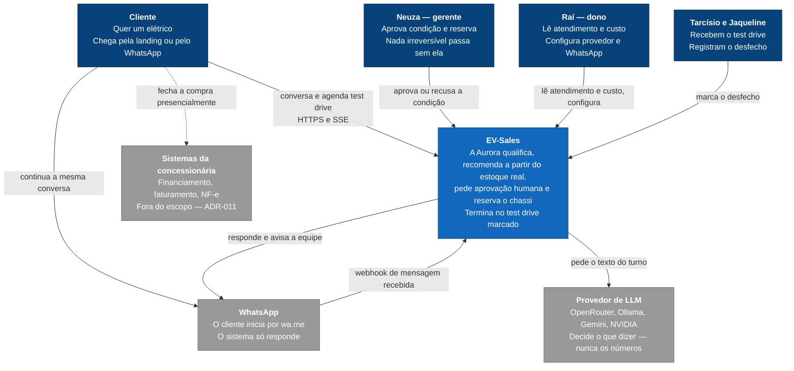
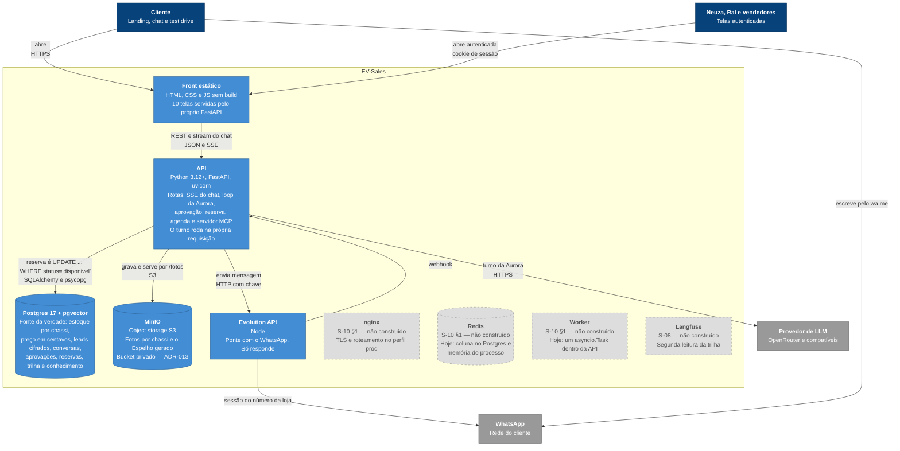
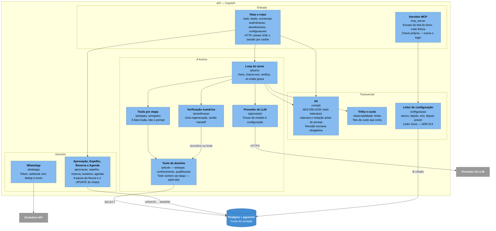
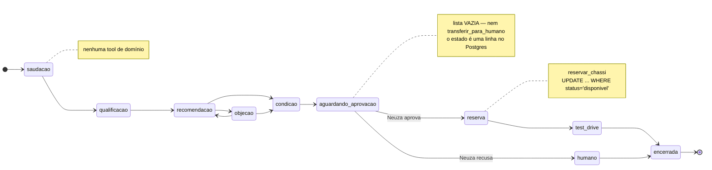

# Arquitetura em C4 — EV-Sales

Os três níveis do [modelo C4](https://c4model.com): contexto, contêineres e componentes.
Estado em **10 de setembro de 2026**, lido do código — não do desenho-alvo.

Desenhados em `flowchart`, não na sintaxe `C4Context` do Mermaid: aquela é experimental e o
Mermaid embutido no Obsidian nem sempre a suporta. O `flowchart` renderiza em qualquer versão,
e as cores seguem a convenção do C4 — azul-escuro para pessoa, azul para o sistema, cinza para
o que é externo.

O [ARQUITETURA.md](ARQUITETURA.md#onde-o-código-está-hoje) desenha o alvo e diz, ao lado, o que
ainda não existe. Aqui é o contrário: o desenho é o que roda, e as caixas **hachuradas** são as
que a [S-10 §1](spec/S-10-operacao.md) e a [S-08](spec/S-08-observabilidade-e-custo.md) ainda devem.

---

## Nível 1 — Contexto

Quem usa o EV-Sales e com o que ele fala.

A seta pontilhada da direita é a fronteira do
[ADR-011](adr/ADR-011-jornada-digital-termina-no-test-drive.md): depois do test drive, a venda
acontece nos sistemas que a loja já opera. Só o **desfecho** volta.

---

## Nível 2 — Contêineres

O que roda, e onde o estado mora. As quatro caixas hachuradas **não existem no código**.

**A pausa não é um processo suspenso.** O Espelho e a reserva esperam a Neuza, e esse estado é uma
linha no Postgres — reiniciar o container no meio não tem efeito. É por isso que não há caixa de
"orquestrador" aqui: [ADR-009](adr/ADR-009-sem-framework-de-orquestracao.md).

---

## Nível 3 — Componentes da API

Dentro do único contêiner que tem lógica.

Repare no caminho do número: **`tools` é o único componente que fala com o estoque**, e a
`verificacao` volta à mesma fonte para conferir o que o modelo escreveu. O `provedor` não toca o
Postgres em lugar nenhum — é a [invariante 1](../CLAUDE.md) desenhada.

---

## O mecanismo central — tools por etapa

Não é C4, mas é o que define o que a Aurora **pode fazer**. A restrição é uma lista, não uma frase
no prompt: [ia/etapas.py](../backend/app/ia/etapas.py).

| Etapa | Tools disponíveis |
|---|---|
| `saudacao` | só `transferir_para_humano` |
| `qualificacao` | `registrar_qualificacao`, `buscar_conhecimento` |
| `recomendacao` | `buscar_unidades`, `detalhar_unidade`, `comparar_unidades`, `buscar_conhecimento` |
| `objecao` | as de `recomendacao` mais `calcular_custo_km` — esta ainda não implementada |
| `condicao` | `solicitar_aprovacao` |
| `aguardando_aprovacao` | **nenhuma** |
| `reserva` | `reservar_chassi` |
| `test_drive` | `consultar_agenda`, `agendar_test_drive` — ainda não implementadas |
| `humano`, `encerrada` | **nenhuma** |

`transferir_para_humano` entra em toda etapa que ainda tem turno da Aurora. As tools marcadas como
não implementadas estão no mapa mas o registro só oferece ao modelo o que existe — ampliar essa
lista exige revisão humana ([CLAUDE.md](../CLAUDE.md)).

---

## Como exportar a imagem no Obsidian

1. Abra esta nota em **Modo de leitura** — os quatro diagramas renderizam.
2. Uma imagem por diagrama: botão direito sobre o SVG → **Copiar imagem**. Página inteira:
   `Ctrl+P` → **Export to PDF**.
3. Diagramas largos: `Ctrl+-` reduz o zoom antes da captura, senão o nível 2 corta na margem.
